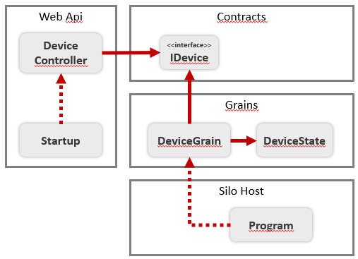

# Orleans Demo

Este é um exemplo de uso do framework Orleans da Microsoft para a construção de aplicações escaláveis e resilientes.
A ideia aqui é simular um sistema que gerencia dispositivos que medem a temperatura (IoT). Cada um dos dispositivos envia para uma API a sua temperatura atual, que é armazenada nos atores (grains) hospedados na camada intermediária (stateful).



Este exemplo considera a persistência dos atores e a gestão do cluster com o uso de um banco de dados SQL Server. A URL de conexão deve ser configurada como um secret da aplicação (chaves *ClusterStorage* e *GrainStorage*)

```bash
dotnet user-secrets set "ConnectionStrings:GrainStorage" "Server=172.17.0.2;Database=orleans;User Id=sa;Password=ABC;"

dotnet user-secrets set "ConnectionStrings:ClusterStorage" "Server=172.17.0.2;Database=orleans;User Id=sa;Password=ABC;"
```

O exemplo foi desenvolvido em uma máquina Ubuntu, com .NET Core 3.0 e rodando um SQL Server 2017 como um container (Docker).

Obs. Os scripts para a criação das tabelas de storage em bases relacionais hoje se encontram na pasta de packages do nuget (~/.nuget/packages/microsoft.orleans.persistence.adonet/3.0.0-beta1/lib/netstandard2.0 e ~/.nuget/packages/microsoft.orleans.clustering.adonet/3.0.0-beta1/lib/netstandard2.0). Há uma discussão pendente de onde melhor ficariam esses scripts, já que anteriormente eles eram instalados junto da solução na hora de baixar os respectivos pacotes Nuget.
